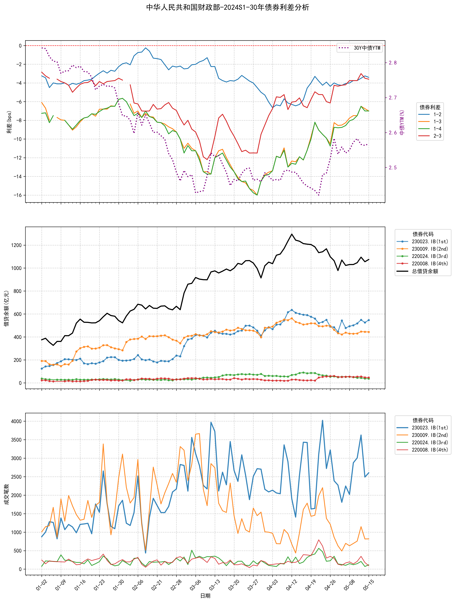

# 项目内容

在第一创业公司实习时对四大行（财政部，中国农业发展银行，国家开发银行，中国进出口银行）发行的同期限债券进行债券间利差分析，主要集中在10年和30年。`利差分析四大行2年_final.csv`包含了24年至25年下旬债券时序的必要数据。基于此csv，
`spread_demo.py`生成利差与借贷额（做空程度）和成交笔数（活跃度）的分析图，见`spread_demo_2y`;
`spread_corr.py`生成最活跃券与次活跃券（1-2）和最活跃券与次次活跃券（1-3）利差与成交笔数比的回归分析，见`spread_demo_corr`;
`spread_boxplots.py`生成利差随时间分布的箱型图，见`spread_demo_boxplots`。

注意：
1.图片文件夹只包含了中华人民共和国财政部（国债）30年债券，更改python文件中的参数可以按自己喜好对其它发债主体，其它期限的债券进行分析。
2.由于活跃券大约3个月切换一次，我们观察了24到25年8月的整体概览，手动定位了活跃券的切换日期，将这1年半的数据按活跃券切换分为了6段，标记为2024S1等，确保了活跃券的稳定，使利差分析有意义。

# 讨论

通常认为同类债券间的利差主要受活跃度影响，即流动性溢价，也可能受到YTM本身波动，市场情绪，金融机构合规要求等次要因素的影响。本研究通过`spread_demo.py`调查了做空程度对利差的影响，发现市场上对同类债券的做空总量大致稳定，最活跃券与次活跃券的做空程度若倒挂会缩小利差。
`spread_corr.py`则发现利差与活跃度比的关系较为复杂，虽然大多数情况下都存在线性关系（皮尔逊相关系数和R方不为0），但该关系随时间周期演进会大幅变化，甚至由正/负相关转为负/正相关，无法给我们有实践意义的结论，这说明“流动性溢价”这一规律并不总是有效，由图也可看出最活跃券-次活跃券的利差常常为正。
然而，`spread_boxplots.py`的结果说明，大部分时间内，尽管最活跃券-次活跃券（1-2）的利差值较为随机，但1-2，1-3，1-4，1-5的利差逐级拉大的现象是明确的，说明流动性溢价在相对意义上是明显的。综上，此研究增进了我们对于债券市场利差现象的理解，在交易时能帮助我们更好地对债券进行定价和预期管理。

